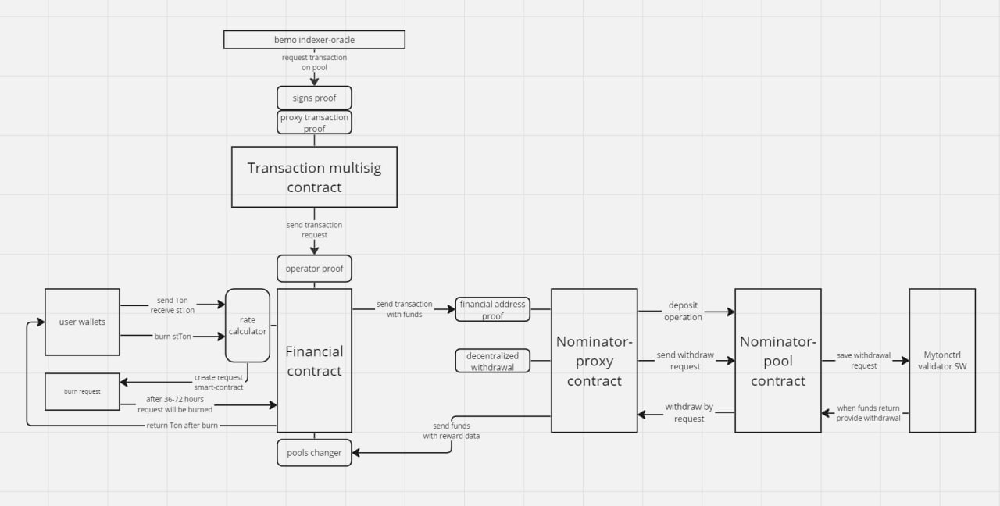
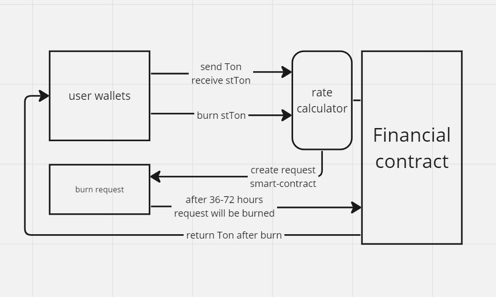
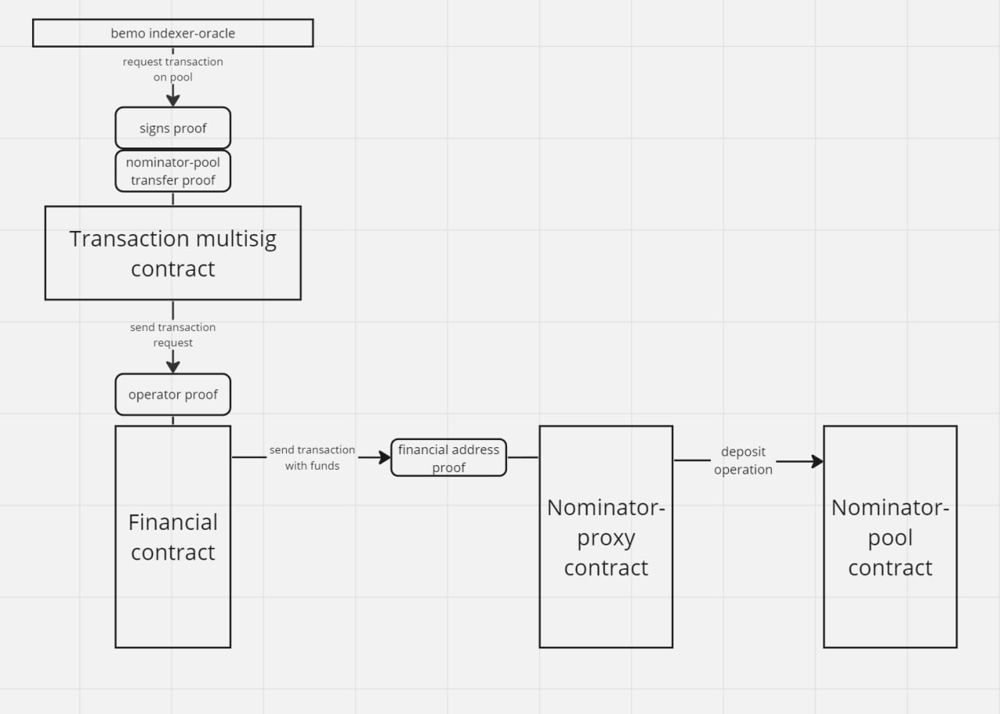
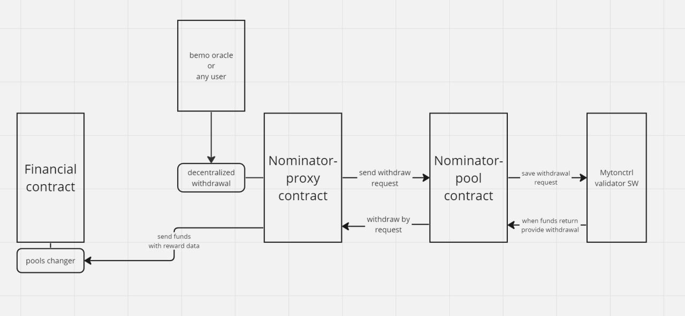

# smart-contract

# Deposit and withdrawal. 

    A user sends Ton to our protocol. It calculates the current rate, and uses it to send stTon to the user's wallet. It is important to note, this is the only possible way to issue stTon. 
To withdraw the tokens must be burned, then the financial s-c will create a request for withdrawal, and will record what amount should be blocked on it for further withdrawal. The requester has a lock of 36-72 hours, depends on the epoch. All this can be done decentralized without us, we can provide instructions.

# Sending funds for validation.

    Our oracle checks the current state of the rounds, and an hour before the validation starts, creates a request to transfer funds from financial s-c to nominaror-pool. For this purpose, we have developed our own transaction multisig s-c, the peculiarity of which is that funds can only be sent to a certain type of contract, namely nominator-pool. Multisig will not be able to request sending assets to any other type of smart contract, including wallet. In case even all keys are lost, an attacker will not gain access to your assets. 
After the request is sent to the financial s-c. That in turn sends the assets to the nominator-proxy. Nominator-proxy participates in the pool as a nominator.

# Validation withdrawals.

    You can send a withdrawal request 10 hours after the nominator-proxy has sent the money for validation. This is enough time for the round to start and finish. Anyone can request a withdrawal. This is done for decentralization, so the assets cannot be locked to the nominator. When the round is over and the assets return to the pool, Mytonctrl software will make a withdrawal to the nominator-proxy. It will in turn send the assets to the financial s-c along with the validation reward data. The financial s-c will change the internal Ton pools, and then the rate will increase.

You can read the technical documentation for smart contracts [here](https://github.com/bemo-fi/smart-contracts-v2-docs) and stake TON [here](https://app.bemo.fi/).
